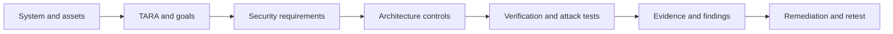
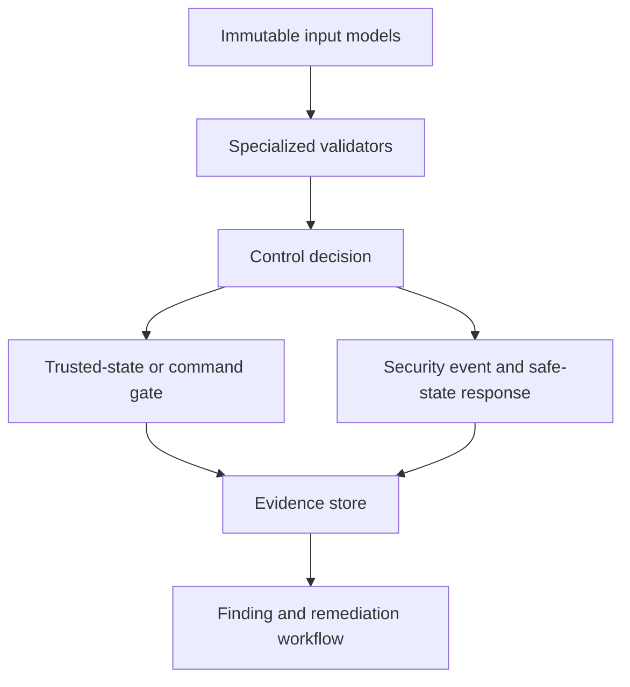

# BMS Cybersecurity Validation Engineering Lab

[](https://github.com/LRTechpro/bms-cybersecurity-validation-lab/actions/workflows/tests.yml)


A pure-Python, simulation-based engineering lab that turns BMS cybersecurity risk into traceable requirements, security controls, automated verification, reproducible evidence, findings, remediation, and passing-retest closure.

## Why this project exists

I built this project to demonstrate how I approach embedded-product cybersecurity as a validation engineer. The work begins with the system and its assets, not with isolated attack scripts. I identify credible threats through TARA, derive testable security requirements, allocate controls, design positive and adversarial tests, preserve evidence, and verify remediation through regression and retest.

The result is a reviewable engineering chain:



## Engineering validation skills demonstrated

| Competency | Evidence in this repository |
|---|---|
| System definition | BMS boundary, external interfaces, trust boundaries, assumptions, exclusions, and safety restrictions |
| TARA | Asset-based threat scenarios, attack paths, multidimensional impact, feasibility, priority, treatment, and residual-risk gates |
| Security requirements engineering | 31 testable technical requirements derived from TARA and cybersecurity goals |
| Cybersecurity architecture | Requirements allocated to 10 controls covering input trust, commands, diagnostics, updates, networks, evidence, and recovery |
| Test design | Positive, negative, boundary, state-transition, replay, spoofing, fuzz, fault-injection, timeout, and recovery cases |
| Python and OOP | Immutable domain models, focused validators, polymorphic executors, dependency injection, and separation of decision from execution |
| Verification automation | 138 automated regression tests plus an engineering-artifact integrity gate in GitHub Actions |
| Traceability | Automated cross-file validation from assets and TARA through requirements, controls, campaign cases, and evidence |
| Evidence and defect closure | Hash-chained records, campaign digest, findings, remediation ownership, linked retest, and closure only after PASS |
| Reproducibility and resilience | Seeded fuzzing, deterministic cases, checkpoint resume, code-version binding, stale-evidence handling, and exception isolation |

## Current verified scope

- 10 security-relevant assets
- 9 TARA records and 9 cybersecurity goals
- 31 baselined technical security requirements
- 10 allocated architecture controls
- 9 end-to-end traceability rows
- 54 deterministic campaign scenarios
- 138 automated regression tests
- Ed25519 signature verification and SHA-256 firmware-image integrity checks
- Sensor/SOC spoofing, replay, malformed CAN/CAN-FD, structured fuzzing, flooding, timing, diagnostic, command, configuration, firmware, and mock BESS/Modbus policy tests
- Mode-aware safe-state decisions, controlled recovery, findings, remediation, and retest closure

## Verification model

This repository deliberately separates three verification layers:

| Layer | Purpose | Current implementation |
|---|---|---|
| Engineering-artifact gate | Detect broken IDs, missing allocations, and gaps in cross-file traceability | Automated by `artifact_validator.py` and CI |
| Component and regression verification | Exercise the actual validators, state machines, codecs, cryptographic checks, evidence logic, and failure paths | 138 pytest tests |
| Capstone campaign | Verify ordered scenario execution, expected-outcome comparison, checkpoint resume, evidence chaining, finding creation, remediation, and retest workflow | 54 deterministic simulated scenarios |

The capstone campaign is an orchestration and evidence demonstration. Its deterministic executors do not claim to replace software-in-the-loop integration, CAN hardware, HIL, penetration testing on an authorized target, or production safety validation. The specialized security logic is exercised directly by the regression suite.

### Verdict semantics

- **PASS**: the observed behavior satisfied the test oracle.
- **FAIL**: the tested control did not meet the security requirement. A deliberately vulnerable baseline can therefore be an expected FAIL.
- **ERROR**: the test framework or executor failed; ERROR is never converted into PASS.
- **Expected match**: the observed verdict matched the planned verdict. It does not mean every scenario returned PASS.

## Architecture



| Component | Responsibility and design reason |
|---|---|
| Domain models | Preserve the exact sensor, frame, command, configuration, firmware, request, and event input |
| Specialized validators | Keep one security responsibility per class and return explicit reasons |
| Trusted-state boundary | Prevent unvalidated data from becoming trusted battery state |
| Command and diagnostic state machines | Enforce identity, freshness, authorization, ordered procedures, and operating-state preconditions |
| Firmware/update path | Separate verification from activation and fail closed on integrity, signature, compatibility, or rollback violations |
| Campaign runner | Inject cases, isolate exceptions, checkpoint progress, compare expected outcomes, and create traceable evidence |
| Evidence store | Preserve complete records with SHA-256 hash chaining and a campaign digest |
| Finding workflow | Deduplicate root causes and prohibit closure until a linked retest passes |

## Repository guide

| Location | What to review |
|---|---|
| [`docs/system_definition.md`](bms_security_lab/docs/system_definition.md) | Item boundary, interfaces, assumptions, exclusions, and authorization limits |
| [`docs/tara_register.csv`](bms_security_lab/docs/tara_register.csv) | Threat scenarios, attack paths, impacts, feasibility, treatment, and residual-risk gates |
| [`docs/security_requirements.csv`](bms_security_lab/docs/security_requirements.csv) | Testable requirements, rationale, control allocation, verification method, and test IDs |
| [`docs/traceability_matrix.csv`](bms_security_lab/docs/traceability_matrix.csv) | TARA-to-goal-to-requirement-to-control-to-evidence chain |
| [`docs/validation_strategy.md`](bms_security_lab/docs/validation_strategy.md) | Test levels, entry/exit criteria, methods, verdicts, evidence, and limitations |
| [`docs/repository_guide.md`](bms_security_lab/docs/repository_guide.md) | Folder structure, execution flow, and suggested reviewer path |
| [`artifact_validator.py`](bms_security_lab/artifact_validator.py) | Automated integrity checks for the engineering baseline |
| [`campaign_builder.py`](bms_security_lab/campaign_builder.py) | Campaign execution, resume, evidence, finding, remediation, and retest orchestration |
| [`evidence/capstone/`](bms_security_lab/evidence/capstone/) | Preserved v1.0.0 reference evidence and human-readable report |

## Install and verify

```powershell
git clone https://github.com/LRTechpro/bms-cybersecurity-validation-lab.git
cd bms-cybersecurity-validation-lab
python -m venv .venv
.venv\Scripts\activate
python -m pip install -r requirements-dev.txt
python -m bms_security_lab.artifact_validator
python -m pytest -q
```

Expected verification result:

```text
ENGINEERING ARTIFACT INTEGRITY: PASS
138 passed
```

## Run the complete capstone

```powershell
python -m bms_security_lab.main --code-version local-build
```

Runtime output is written to the gitignored `bms_security_lab/evidence/runs/` directory so the preserved capstone evidence is not overwritten:

```text
checkpoint.json
campaign_evidence.json
evidence.jsonl
campaign_report.md
```

To demonstrate interruption and controlled resume, execute only 20 new cases and then resume the same code version:

```powershell
python -m bms_security_lab.main --max-cases 20 --code-version local-build
python -m bms_security_lab.main --code-version local-build
```

The checkpoint is bound to the campaign definition and code version. A changed code version archives the prior evidence as stale and starts a fresh run rather than silently reusing obsolete results.

## Evidence and finding workflow

Each campaign record preserves the campaign and test IDs, TARA, goal, requirement, controls, exact scenario input, preconditions, expected and observed results, reasons, environment, code version, evidence path, prior-record hash, and current-record hash.

One designed vulnerable baseline demonstrates the response loop:

1. A spoofed SOC reaches an intentionally vulnerable trusted-state path.
2. The expected verdict is FAIL and a finding is created.
3. The remediation is recorded against the trusted-state boundary.
4. A linked retest verifies the spoofed value is rejected.
5. The finding closes only after the new evidence record reports PASS.

## Engineering boundaries

This is a portfolio-quality simulation and validation framework, not a production BMS or certification artifact. It does not claim:

- OEM or supplier production ownership
- ISO/SAE 21434 or ISO 26262 certification
- Production HSM, secure-element, key-provisioning, or safety mechanisms
- Product-specific cell chemistry, limits, or safety calibration
- HIL, live CAN, energized high-voltage, field BESS, or third-party penetration-test results
- Authorization to connect the code to a vehicle, battery pack, or operational site

All attacks remain in local simulation. Production use would require written authorization, safety controls, qualified personnel, target-specific requirements, representative hardware, independent review, and controlled recovery procedures.

## How I explain the engineering approach

> I treated the BMS as an engineering item with assets, interfaces, trust boundaries, and safety-relevant behavior. I used TARA to identify credible attack paths and derive technical security requirements. I allocated those requirements to focused controls, then designed automated positive, negative, boundary, stateful, fuzz, and recovery tests. The Python architecture keeps inputs, validation decisions, state changes, execution, and evidence separate. Every campaign result is traceable back to the risk and requirement, and a finding cannot close until remediation is followed by a passing retest. The lab is simulation-only, but it demonstrates the validation method I would carry into SIL, HIL, bench, and authorized product testing.

## Security design notes

- Ed25519 verifies signatures over the exact stored manifest bytes.
- SHA-256 verifies the firmware-image digest carried in the manifest.
- Disposable private signing keys are generated only in tests and are not stored in runtime modules.
- Application CRC is treated as error detection, not cryptographic authentication.
- Validation decisions remain separate from trusted-state mutation and command execution.
