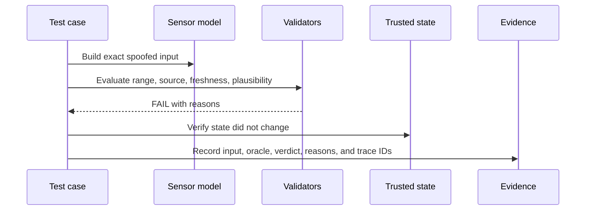

# Repository and Execution Guide

## 1. How the repository is organized

```text
bms-cybersecurity-validation-lab/
├── README.md                         Recruiter and reviewer entry point
├── requirements-dev.txt              Reproducible development dependencies
├── .github/workflows/tests.yml       CI artifact gate and regression suite
└── bms_security_lab/
    ├── docs/                         Engineering baseline and strategy
    ├── evidence/capstone/            Preserved reference evidence
    ├── *_model.py                    Immutable or state-focused domain models
    ├── *_validator.py                Focused security-control decisions
    ├── secure_boot.py                Firmware trust and execution gate
    ├── update_manager.py             Installation, activation, and recovery
    ├── frame_fuzzer.py               Seeded structured fuzz generation
    ├── safe_state.py                 Mode-aware safe-response decisions
    ├── evidence_report.py            Hash-chained records and reports
    ├── finding.py / remediation.py   Defect and retest lifecycle
    ├── artifact_validator.py         Cross-file traceability gate
    ├── campaign_builder.py           Campaign orchestration and evidence flow
    ├── main.py                       Command-line campaign entry point
    └── test_*.py                     Automated component and regression tests
```

## 2. Responsibility of each layer

| Layer | Files | Engineering responsibility |
|---|---|---|
| Definition | `docs/system_definition.md`, asset and TARA CSV files | Establish what is being protected, from whom, and within which boundary |
| Requirements | goals, requirements, controls, and traceability CSV files | Convert risk into reviewable and verifiable engineering obligations |
| Domain | sensor, CAN, command, diagnostic, configuration, firmware, Modbus, and event models | Preserve inputs and state without hiding validation behavior |
| Control | validator, policy, secure-boot, timing, traffic, safe-state, and recovery classes | Make one explicit security decision with traceable reasons |
| Verification | `test_*.py`, fuzzer, artifact validator | Exercise normal, adverse, boundary, stateful, and internal-failure paths |
| Orchestration | campaign builder, test runner, checkpoint store | Execute independently, resume safely, and prevent one error from stopping coverage |
| Evidence | evidence report, finding, remediation | Record results, preserve integrity, manage findings, and require retest for closure |

## 3. Data flow for one sensor-spoofing test



The important design choice is that input validation and trusted-state mutation are separate. A validator returns a decision; it does not silently update the BMS state.

## 4. Data flow for secure boot

1. Parse the exact stored manifest bytes.
2. Check issuance and expiration time.
3. Resolve signer identity and key lifecycle state.
4. Verify the Ed25519 signature over the stored manifest bytes.
5. Hash the stored firmware image with SHA-256 and compare it with the signed manifest value.
6. Verify ECU target, hardware compatibility, and anti-rollback policy.
7. Issue an execution token only when every check passes.
8. Reverify the stored package before activation and compare it with the original token.
9. Enter a defined SAFE, RECOVERY, ROLLED_BACK, or ACTIVE state according to the result.

## 5. Suggested reviewer path

For a 10-minute technical review:

1. Read the README engineering-skills and verification-model sections.
2. Review `system_definition.md` and one TARA row.
3. Follow that TARA row into `security_requirements.csv` and `traceability_matrix.csv`.
4. Inspect the corresponding validator and pytest module.
5. Review `artifact_validator.py` to see how documentation drift is prevented.
6. Review `campaign_builder.py` and the preserved capstone report for evidence and remediation flow.

For an interview demonstration, the strongest examples are:

- `test_spoofed_soc_is_rejected`: adversarial input and trusted-state protection
- `test_corrupted_firmware_image_fails_hash_check`: firmware integrity and fail-closed behavior
- diagnostic negative tests: session, SecurityAccess, ordered programming, and lockout
- capstone finding/retest tests: evidence-based remediation closure

## 6. Commands

```powershell
# Validate engineering artifacts
python -m bms_security_lab.artifact_validator

# Run the complete regression suite
python -m pytest -q

# Deep-dive one threat test
python -m pytest bms_security_lab/test_secure_boot.py::test_corrupted_firmware_image_fails_hash_check -v

# Run the 54-case orchestration/evidence campaign
python -m bms_security_lab.main --code-version local-build
```

## 7. What changes when moving to a real BMS

The engineering chain remains the same, but the adapters and evidence sources change. Python domain models would be replaced or supplemented by a CAN/CAN-FD interface, diagnostic transport, BMS SIL/HIL plant model, target power and reset control, measurement equipment, product-specific requirements, and controlled evidence collection. Safety procedures, authorization, recovery, and configuration control become formal entry criteria.
