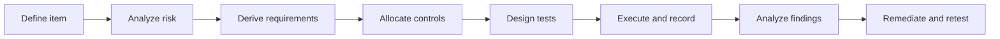

# BMS Cybersecurity Validation Strategy

## 1. Purpose

This strategy defines how the simulation-based BMS cybersecurity baseline is verified. It connects the item definition and TARA to testable requirements, control behavior, verdicts, evidence, findings, remediation, and regression.

The objective is to answer four engineering questions:

1. Is each planned security requirement connected to a credible risk and allocated control?
2. Does the implemented control produce the required behavior for normal, boundary, invalid, adversarial, and failure inputs?
3. Can another reviewer reproduce the result and understand why the verdict was assigned?
4. If a weakness is found, is closure supported by remediation and a new passing retest?

## 2. Item under validation

The primary item is the simulated vehicle BMS defined in `system_definition.md`. The optional BESS/Modbus model is a separate policy-focused extension. No live vehicle, energized battery, operational BESS site, supplier ECU, or production network is included.

## 3. Validation lifecycle

### Required engineering artifacts

- System definition and authorization boundary
- Asset inventory
- TARA register
- Cybersecurity goals
- Technical security requirements
- Architecture-control allocation
- Traceability matrix
- Automated test implementation
- Evidence record and campaign report
- Finding, remediation, and retest record when applicable

## 4. Verification levels

### Level 1: Engineering-artifact integrity

`python -m bms_security_lab.artifact_validator` checks that required CSV schemas are present, primary IDs are unique, cross-file references resolve, all requirements appear in the traceability matrix, and all campaign cases reference valid TARA, goal, requirement, and control IDs.

This gate detects documentation drift before behavioral results are accepted.

### Level 2: Component and regression verification

Pytest directly exercises the control implementations and failure paths. Current coverage includes:

- Sensor range, authenticity, plausibility, cross-signal agreement, source trust, and trusted-state gating
- Replay, freshness, counter handling, CAN/CAN-FD parsing, malformed input, deterministic structured fuzzing, traffic, timeout, latency, and bounded resources
- High-impact command authorization and operating-state preconditions
- Diagnostic sessions, security access, roles, ordered programming, invalid-key attempts, delay, and lockout
- Configuration integrity, compatibility, relationships, and change evidence
- Secure boot, Ed25519 signature verification, SHA-256 image integrity, signer lifecycle, anti-rollback, verify-to-activate, interruption, health check, and recovery
- Mock BESS/Modbus identity, role, network-zone, function, address-range, and rate policy
- Security events, anomaly correlation, safe-state selection, authorized recovery, hash-chained evidence, checkpointing, findings, remediation, and retest

### Level 3: Capstone campaign

The 54-case campaign verifies the validation framework itself: ordered execution, expected-outcome comparison, exception isolation, resume, stale-evidence handling, complete evidence, campaign digest, finding creation, remediation state, retest linkage, and closure rules.

The campaign uses deterministic simulated executors. It is not represented as HIL, live-bus, or production-target penetration testing.

### Future levels outside the current claim

- Software-in-the-loop integration against a representative BMS application
- Virtual or physical CAN/CAN-FD transport integration
- Bench and HIL execution with representative ECUs and plant models
- Timing and resource measurement on target hardware
- Authorized penetration testing of a defined product configuration
- Functional-safety co-analysis and production residual-risk acceptance

## 5. Test-design methods

| Method | Purpose | Examples |
|---|---|---|
| Positive | Confirm an authorized valid path remains available | Valid sensor input, signed firmware, authorized monitor read |
| Negative | Confirm prohibited behavior fails closed | Invalid signature, unauthorized close, programming before unlock |
| Boundary | Verify behavior at and just outside a limit | SOC, temperature, payload length, timestamp age, register range |
| State transition | Verify preconditions and ordered behavior | Precharge before contactor close, diagnostic programming sequence |
| Replay and freshness | Reject previously valid but contextually stale input | Duplicate counter, rollback, old timestamp, repeated command |
| Cross-signal plausibility | Detect believable values that conflict with related state | SOC/current/voltage disagreement and excessive rate of change |
| Structured fuzzing | Explore malformed values while preserving reproducibility | Seeded identifiers, payload sizes, flags, counters, and metadata |
| Fault injection | Verify framework and recovery behavior during internal failure | Executor exception, checkpoint change, interrupted installation |
| Recovery and retest | Prove safe restoration and defect closure | Verified recovery image, authorized recovery, linked passing retest |

## 6. Entry criteria

A verification run is eligible to start when:

- The intended system boundary and simulation-only authorization are documented.
- TARA, goals, requirements, controls, and traceability artifacts pass the integrity gate.
- Test preconditions and expected verdicts are defined.
- The code version and deterministic seed, where applicable, are recorded.
- The output directory is isolated from the preserved release evidence.

## 7. Verdict and oracle rules

- **PASS** means the observed behavior met the requirement-specific expected behavior.
- **FAIL** means the control did not satisfy the requirement. A deliberately vulnerable baseline may be planned to return FAIL so the finding and remediation workflow can be tested.
- **ERROR** means the test infrastructure or executor failed. ERROR can never be interpreted as evidence of control effectiveness.
- **BLOCKED** is reserved for an unsatisfied external precondition where execution cannot produce a valid technical verdict.
- **Expected match** means observed status equals planned status; it does not mean every case passed.

The oracle must evaluate externally observable behavior, including rejection or acceptance, reasons, unchanged trusted state, execution permission, safe-state action, or evidence creation. A test does not pass merely because no exception occurred.

## 8. Exit criteria

The current simulated campaign is complete when:

- Artifact integrity reports PASS.
- The regression suite has no failures or collection warnings.
- Every planned campaign case has a verdict and complete evidence record.
- Unexpected outcomes are zero, or each is dispositioned as an open finding.
- Evidence-chain verification and the campaign digest succeed.
- Framework failures remain ERROR and do not suppress later cases.
- Each closed finding has a recorded remediation and a linked passing retest.
- Residual-risk wording remains limited to the simulated scope.

## 9. Evidence requirements

Each campaign result records:

- Campaign and test identifiers
- TARA, cybersecurity goal, requirement, and architecture-control identifiers
- Input scenario and execution preconditions
- Expected and observed results
- Verdict and reasons
- Timestamp, environment, and code version
- Evidence path
- Previous-record and current-record hashes

Hash chaining provides tamper evidence, not tamper prevention, identity attestation, trusted time, or non-repudiation. Production evidence would require protected storage, access control, trusted identity, time synchronization, and independent retention requirements.

## 10. Finding and closure rule

A failed security control creates or links to a finding by root cause. Applying a code change moves the work into remediation, but it does not close the finding. Closure requires a new test execution that:

- targets the same requirement and root cause,
- runs against the remediated code version,
- returns PASS,
- preserves a new evidence hash, and
- does not create an unacceptable regression elsewhere.

## 11. Known limitations and maturity statement

The Python models demonstrate engineering reasoning and automated control verification. They do not model electrochemistry, production BMS scheduling, hardware timing, real transceivers, secure-element behavior, safety mechanisms, or supplier-specific implementations.

Debug/boot-interface coverage is currently a baselined requirement and policy-model concept; physical JTAG/SWD, console, lifecycle-fuse, and silicon-root-of-trust testing are not implemented. This gap remains explicit rather than being counted as completed hardware validation.
